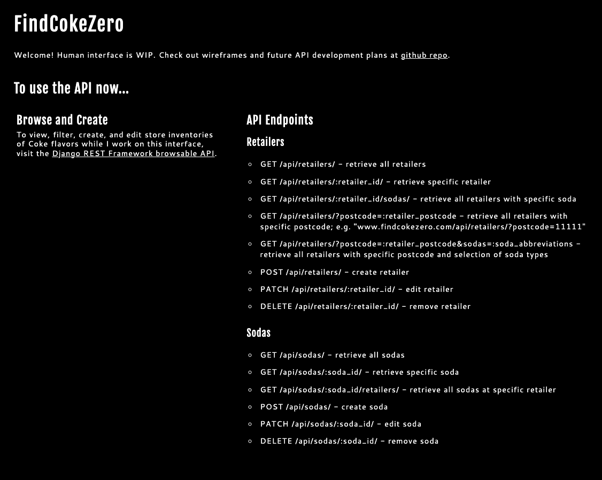
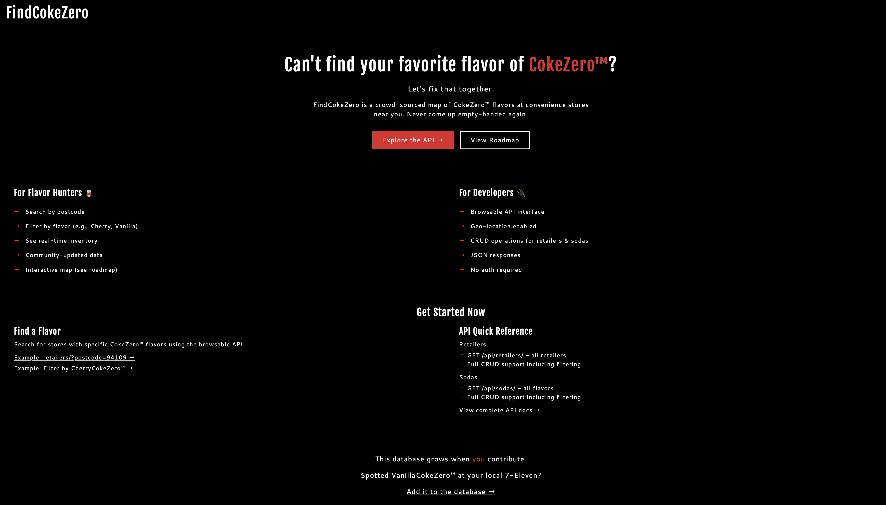
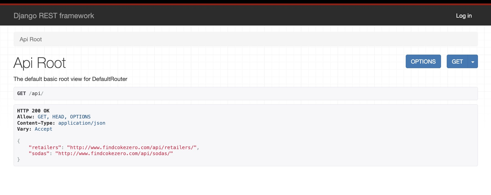
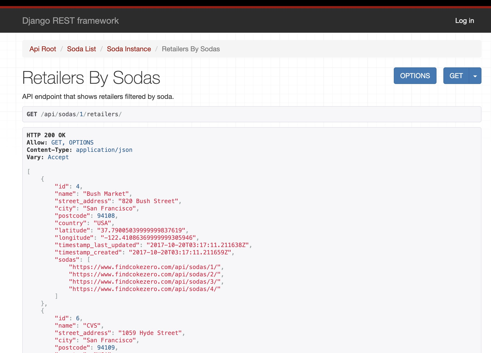
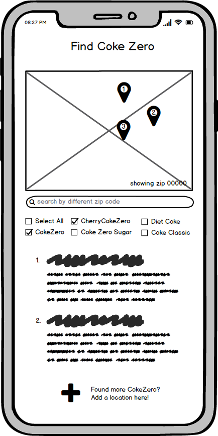
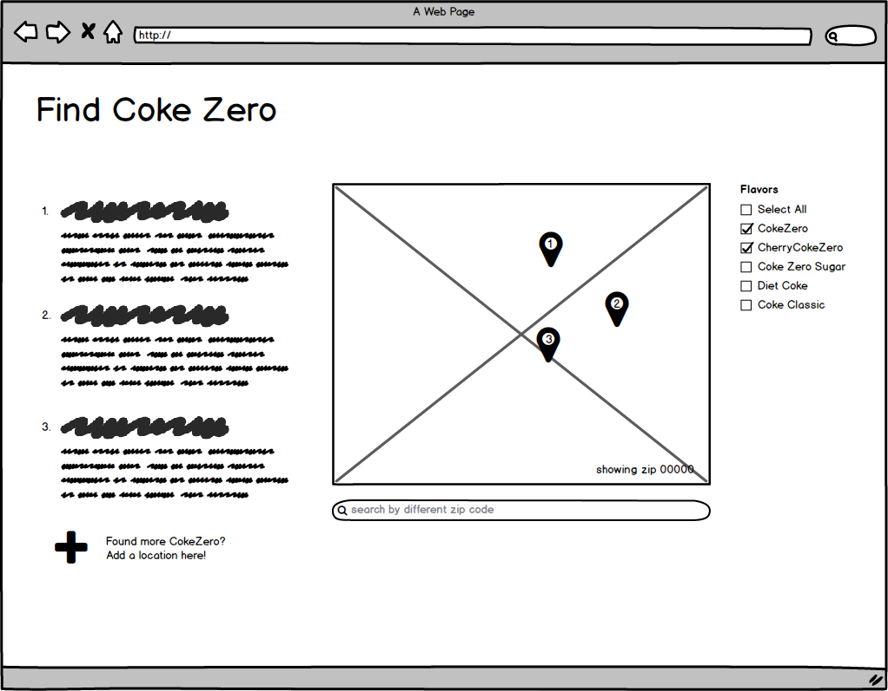

# FindCokeZero
Test-driven Django REST Framework API that maps convenience stores and filters by flavors of CokeZero™ 
- Integration with Google Maps supports geo-location. 
- Django REST framework enables browsable API and administrative management. 
- Landing page with API documentation: www.findcokezero.com 
- Browsable API: www.findcokezero.com/api/ 

<p align="center">
  
  
</p>

## Background
This app tracks CokeZero™ flavor inventories by store and uses crowd-sourcing to grow the database in hopes of always knowing where to reliably find CherryCokeZero™.
Why? I built this app during a time when I drank a LOT of CherryCokeZero™. 
I was living in San Francisco, where the inventory of CokeZero™ flavors fluctuated dramatically between stores. 
Surely, I was not the only person frustrated by this. So I built this app primarily to learn about the Django framework
and secondarily to more reliably find the original formula of CherryCokeZero™ in local stores.

## Architecture
This project uses a classic django structure with two major directories: a project directory (manages common infrastructure)
and an app directory (manages business logic). As this project grows, more app directories could be added to manage additional domains.

The diagram below illustrates the current structure with a sample of directories and files.

```
findcokezero/                      # root includes files that manage dependencies, environments, and deployments
│
├── manage.py                      # django command-line utility
├── pyproject.toml                 # dependency management and project metadata
├── Procfile                       # heroku deployment configuration
│
├── config/                        # PROJECT: entry point, configuration, and infrastructure
│   ├── settings.py                # primary configuration file for django
│   ├── wsgi.py                    # web server entry point
│   ├── urls.py                    # root URL routing
│   ├── views.py                   # landing page view
│   ├── templates/                 
│   └── static/                    # static assets (CSS, JavaScript)
│
└── inventory/                     # APP: domain logic & business functionality (e.g., sodas, retailers)
    ├── urls.py                    # API URL routing
    ├── views.py                   # API endpoints
    ├── serializers.py             # API serializers
    ├── models.py
    ├── migrations/                # database migrations
    ├── fixtures/
    │   └── initdata.json          # seed data
    └── tests/                     # test suite
```

## API Endpoints

### LANDING PAGE

- `GET /` - serves HTML template at www.findcokezero.com



### JSON API
*Don't forget closing slash unless url includes a query string*

- `GET /api/` - serves root of browsable API at www.findcokezero.com/api/




#### Retailers

|Endpoint                                         | Description                                   | Example
|-------------------------------------------------|-----------------------------------------------|------------
| GET /api/retailers/                             | retrieve all retailers                        | www.findcokezero.com/api/retailers/
| GET /api/retailers/:retailer_id/                | retrieve specific retailer                    |
| GET /api/retailers/:retailer_id/sodas/          | retrieve all sodas at specific retailer       | www.findcokezero.com/api/retailers/2/sodas/
| GET /api/retailers/?postcode=:retailer_postcode | retrieve all retailers with specific postcode | www.findcokezero.com/api/retailers/?postcode=11111
| GET /api/retailers/?postcode=:retailer_postcode&sodas=:soda_abbreviations | retrieve all retailers with specific postcode and selection of soda types | www.findcokezero.com/api/retailers/?postcode=94108&sodas=CH,CZ
| POST /api/retailers                             | create retailer                               |
| PATCH /api/retailers/:retailer_id/              | edit retailer                                 |
| DELETE /api/retailers/:retailer_id/             | remove retailer                               |



#### Sodas

|Endpoint                             | Description                               | Example
|-------------------------------------|-------------------------------------------|------------
| GET /api/sodas/                     | retrieve all sodas                        | www.findcokezero.com/api/sodas
| GET /api/sodas/:soda_id/            | retrieve specific soda                    |
| GET /api/sodas/:soda_id/retailers/  | retrieve all retailers with specific soda | www.findcokezero.com/api/sodas/2/retailers/
| POST /api/sodas/                    | create soda                               |
| PATCH /api/sodas/:soda_id/          | edit soda                                 |
| DELETE /api/sodas/:soda_id/         | remove soda                               |


## Tech Stack
*see pyproject.toml for full list*

- uv (package management)
- Python 3.12.1 
- Django 4.2.18 LTS
- Django REST Framework 3.15.2
- PostgreSQL 
- psycopg2-binary (python driver/adaptor for postreSQL)
- WhiteNoise 6.8.2 (static file serving)
- Gunicorn 23.0.0 (production server)

## Setup

### Environment Variables
This application uses environment variables for configuration via `.env` file (local) or hosting platform config (production).

- `GOOGLEMAPS_KEY`: Google Maps API key for geolocation (required)
- `DEBUG`: Set to `False` in production (defaults to `True` for local development)
- `SECRET_KEY`: Django secret key for cryptographic signing (optional for local development, required for production)
- `DATABASE_URL`: PostgreSQL database connection string (optional, auto-configured for local development)
- `DB_USER`: PostgreSQL username (optional, defaults to empty string for local development)

For local development, default values are provided with the exception of `GOOGLEMAPS_KEY` (instructions below).
In production, `GOOGLEMAPS_KEY`, `DEBUG=False`, and `SECRET_KEY` must be explicitly set. Heroku automatically sets `DATABASE_URL`.

#### Option A: Set environment variables in .env file

1. Configure `.env` file.
- Create a file called `.env` at the top level of the repo. This file is gitignored to prevent committing secrets.
- Copy the content of `.env.example` (committed in this repo) into your new file.

2. Set `GOOGLEMAPS_KEY`.
- Get a free API key [here](https://developers.google.com/maps/documentation/geocoding/get-api-key).
- Replace `your-google-maps-api-key-here` in `.env` with the actual API key.

_To run the app locally, the above are the only required steps with regard to environment variables._

3. (optional) Set `SECRET_KEY`.
- Some value must be defined for this variable in order for Django to start. 
- This variable is optional for local development because a real cryptographic key is not necessary for handling test/seed data on a local server. 
- The `settings.py` file includes fallback logic which preconfigures this variable for you by defaulting to an obviously insecure string: `django-insecure-dev-key-only-for-local-development-do-not-use-in-production`.
- If you want to use a real cryptographic key for local development, generate a secret key (using below commands) and paste it in `.env`.
     ```
     python -c 'from django.core.management.utils import get_random_secret_key; print(get_random_secret_key())'
     ```
- Never use the insecure default string in production.

4. (optional) Set `DATABASE_URL`.
- The `settings.py` file includes a default PostgreSQL configuration for local development.
- If `DATABASE_URL` is explicitly set, it will override that default.
- This environment variable is automatically set by Heroku in production.

5. (optional) Set `DB_USER`.
- PostgreSQL username for database connection.
- Defaults to empty string, which works for most local PostgreSQL installations.
- Only needed if your local PostgreSQL requires authentication.

6. (optional) Set `DEBUG`.
- Defaults to `True` for local development.
- **Must be set to `False` in production** for security.
- Example: `DEBUG=False` in production `.env` or hosting platform configuration.

#### Option B: Store environment variables in terminal shell
```
export GOOGLEMAPS_KEY="your-api-key-here" # required for local development
export SECRET_KEY="your-secret-key-here" # optional for local development
```
_NB: These terminal exports are temporary and only persist for the current terminal session._

### Development Environment

1. Install uv package manager
   [uv](https://docs.astral.sh/uv/)
   ```
   curl -LsSf https://astral.sh/uv/install.sh | sh
   ```

2. Create virtual environment
   ```
   uv venv .venv
   ```

3. Install dependencies
   ```
   uv sync
   ```

4. Activate the virtual environment
   ```
   source .venv/bin/activate
   ```

### Database

1. Install PostgreSQL
   ```
   brew install postgresql@14
   ```
   _Note: PostgreSQL 14 or later should work. Version 14 is specified for consistency._

2. Start PostgreSQL service
   ```
   brew services start postgresql@14

   # alternative: start the service temporarily (stops when terminal closes)
   pg_ctl -D /opt/homebrew/var/postgresql@14 start
   ```

3. Create local PostgreSQL database
   ```
   createdb findcokezero_dev
   
   # verify database was created
   psql -l | grep findcokezero_dev
   ```

4. Migrate the database
   ```
   ./manage.py makemigrations
   ./manage.py migrate
   ```

5. Load seed data 

   ```
   ./manage.py loaddata initdata.json
   
   # alternatively with uv
    uv run ./manage.py loaddata initdata.json
   ```
   
   Seed data is located in `inventory/fixtures/initdata.json` and includes:
   - 6 Soda types: CherryCokeZero™ (CH), CokeZero™ (CZ), DietCoke™ (DC), VanillaCokeZero™ (VN), OrangeVanillaCokeZero™ (OV), Unspecified (UN)
   - 6 Retailers: San Francisco stores with geographic coordinates and soda inventory

## Run the Program

### Development Server
1. Start Django development server
   ```
   ./manage.py runserver

   # alternatively with uv
   uv run ./manage.py runserver
   ```
   
2. View in browser
   - Landing page with API documentation: http://127.0.0.1:8000/
   - Browsable API: http://127.0.0.1:8000/api/

### Production Server (for local testing)
The production environment of this project is hosted on Heroku, where the entry point for the WSGI server is `config/wsgi.py`. 

Gunicorn is a production WSGI server that we can use to test this entry point.
But for day to day development, use Django's development server instead.

1. Start the production server locally.
   ```
   gunicorn config.wsgi:application

   # with logging to console (matches Heroku configuration)
   gunicorn config.wsgi:application --log-file -

   # alternatively with uv
   uv run gunicorn config.wsgi:application --log-file -
   ```
   
2. View in browser
   - Landing page with API documentation: http://127.0.0.1:8000/
   - Browsable API: http://127.0.0.1:8000/api/

## Local Development

### Test Suite
Django automatically creates and destroys a test database when running tests. 
The test database is named `test_findcoke_dev1` and is isolated from development data.

   **Run automated tests:**
   ```
   ./manage.py test

   # alternatively with uv
   uv run ./manage.py test
   ```

   **Run manual curls from script:**
   ```
   ./manage.py runserver

   # in a different terminal
   ./inventory/tests/manual_test.sh
   ```

### Type Checking
Run type checking tool before committing changes.

   **Configuration:** See `[tool.mypy]` in `pyproject.toml`. The current configuration is permissive to support gradual adoption of type hints.

   **Run type checking:**
   ```
   mypy inventory config manage.py

   # alternatively with uv
   uv run mypy inventory config manage.py
   ```

### Static Files
`config/static/` contains source code. Edit these files directly. `config/staticfiles/` are auto-generated by django.

   **(troubleshooting) Manually trigger generation of the content for `staticfiles`:**
   ```
   ./manage.py collectstatic
   ```

### Dependency Management

   **Add a dependency:**
   ```
   uv add package-name
   ```
   
   **Remove a dependency:**
   ```
   uv remove package-name
   ```
   
   **Upgrade a dependency:**
   ```
   uv lock --upgrade-package package-name
   
   # upgrade all packages
   uv lock --upgrade
   ```

### Database Operations

   **Create new migrations after model changes**
   ```
   ./manage.py makemigrations
   ```

   **Apply migrations**
   ```
   ./manage.py migrate
   ```

   **Load seed data**
   ```
   ./manage.py loaddata initdata.json
   ```

   **Flush database (clear all data, keep schema)**
   ```
   ./manage.py flush
   ```

   **Drop, recreate, and reseed database**
   ```
   dropdb findcokezero_dev
   createdb findcokezero_dev
   ./manage.py migrate
   ./manage.py loaddata initdata.json
   ```

## Future Development
Build client that shows map of retailers based on some geographic input (e.g., current user location or manually entered zip code)

### Wireframes
Mobile and web wireframes in [development docs](./docs/).

#### Mobile sample


#### Web sample
